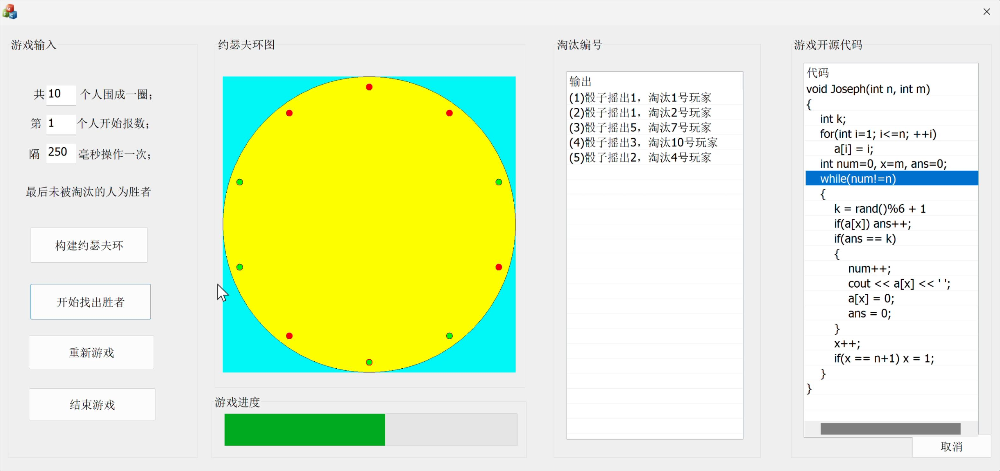

# tongji-DataStructure-CourseDesign
同济大学 数据结构课设：约瑟夫环和排序可视化，以下为ai总结，请自行参考
# 数据结构与算法课程设计

本项目包含两个主要部分：**排序算法可视化**和**约瑟夫环问题模拟**，分别基于Python（pygame）和C++（MFC）实现。通过图形化界面直观展示算法执行过程，帮助理解经典数据结构与算法的实现细节。

---

## 📋 项目概览

### 1. 排序算法可视化（Python + pygame）
- **实现算法**：直接插入排序、折半插入排序、希尔排序、快速排序、冒泡排序、简单选择排序。
- **功能特性**：
  - 动态生成随机数据并可视化排序过程。
  - 支持调整排序速度、数据规模及算法选择。
  - 实时高亮比较元素（红色）和关键节点（蓝色）。
  - 暂停/继续功能，支持中途跳过动画直接显示结果。

### 2. 约瑟夫环模拟（C++ + MFC）
- **核心规则**：N人围坐成圈，每轮掷骰子确定报数间隔，淘汰报数到目标者，直至剩最后一人。
- **功能特性**：
  - 输入总人数、起始位置和动画刷新间隔。
  - 动态展示淘汰过程（绿色存活、红色淘汰）。
  - 输出每轮骰子结果、淘汰顺序及最终胜者。
  - 进度条显示游戏进度，支持重新开始或结束游戏。

---

## 🛠️ 技术栈
- **排序可视化**：
  - 语言：Python 3.x
  - 库：pygame（图形界面）、pyinstaller（打包为exe）
- **约瑟夫环模拟**：
  - 语言：C++
  - 框架：MFC（Microsoft Foundation Classes）
- 开发环境：Visual Studio（C++）、PyCharm/Python IDE

---

## 🚀 快速开始

### 排序算法可视化
1. **安装依赖**：
   ```bash
   pip install pygame
   ```
2. **运行程序**：
   - 直接运行源码：
     ```bash
     python main.py
     ```
   - 或使用预编译的`sorting_visualizer.exe`（位于`/sorting_visualizer`目录）。

3. **操作说明**：
   - 修改数据规模：在`Size`输入框键入数字（默认100）。
   - 调整速度：拖动`Delay`滑块。
   - 选择算法：点击`Algorithm`下拉框。
   - 开始/暂停：点击绿色三角按钮或空格键。

### 约瑟夫环模拟
1. **编译运行**：
   - 使用Visual Studio打开`JosephRing.sln`文件。
   - 编译并运行（生成`JosephRing.exe`）。
2. **操作说明**：
   - 输入总人数（2-100）、起始位置（1-N）、刷新间隔（50-1500ms）。
   - 点击**构建约瑟夫环**初始化。
   - 点击**开始找出胜者**启动模拟。
   - 点击**重新游戏**或**结束游戏**重置或退出。


---

## 📸 截图示例

### 排序可视化界面


### 约瑟夫环模拟


---

欢迎提交Issue或PR，共同改进项目！ 🚀
``` 

---

**提示**：  
1. 请将项目中的截图文件（如`image1.png`）放入`media`目录，并确保路径正确。  
2. 若需打包Python程序为exe，可使用：  
   ```bash
   pyinstaller --onefile main.py
   ```  
3. MFC项目需使用Visual Studio 2019或更高版本编译。
